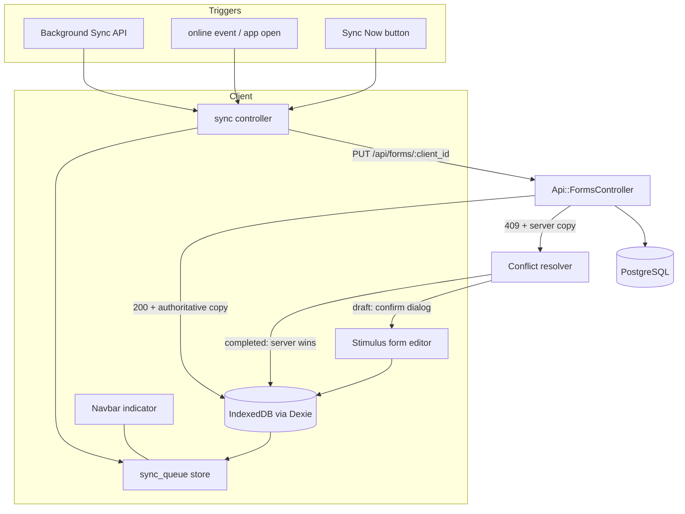
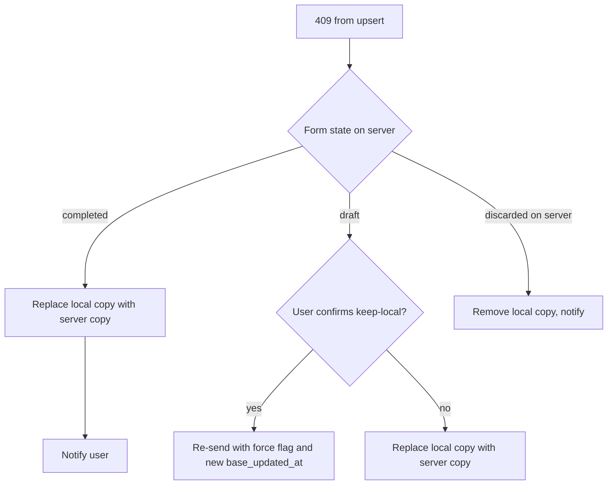

# Offline-First Stack - Plan

## Goal Capsule

- **Objective:** Deliver the offline-first capability defined in ADR-3 (`docs/architecture.md`) and acceptance criteria section 5 (`docs/acceptance-criteria.md`): forms can be created, edited, and viewed entirely offline in Spanish or English, with reliable queue-based sync and explicit conflict resolution.
- **Authority hierarchy:** ADR-3 and acceptance criteria section 5 define behavior; this plan defines the technical approach; repo conventions (`.rubocop.yml`, existing Stimulus patterns) govern style. Where this plan amends an ADR choice, the amendment is recorded as a KTD and the ADR text should be updated in the same unit.
- **Stop conditions:** Stop and surface if implementation discovers that Devise session behavior makes background sync from the service worker unworkable (KTD-6 fallback becomes primary), or if the local-first editor (U6) requires changing the completed-form results flow beyond read-only hydration.
- **Execution profile:** Phased. U1 to U5 are independent infrastructure and API work; U6 onward reshape the form-entry flow and must land in order.
- **Tail ownership:** Conflict UX polish and multi-device edge cases beyond the AC 5.4 matrix are deferred, not silently included.

---

## Product Contract

### Summary

Predium v2 must work in the field with no connectivity from the first release. This plan adds the entire offline layer to an app that is currently fully server-rendered and online-only: a PWA shell (manifest plus service worker with the four ADR-3 cache strategies), Dexie-backed IndexedDB stores, JSON endpoints for questionnaire config and form sync, a local-first form entry flow, a sync queue with Background Sync and manual fallback, conflict resolution, and a connectivity indicator. Spanish must work offline, so locale data is cached alongside the questionnaire config.

### Problem Frame

The service worker at `app/views/pwa/service-worker.js` is the untouched Rails stub, the manifest is neither routed nor linked, and no client-side persistence or sync code exists. Extension agents and farmers fill in diagnosis forms on farms without signal; today the app is unusable there. The questionnaire is also expected to change, so whatever is cached client-side must be invalidatable, not baked in.

### Requirements

**PWA shell and caching**

- R1. The app is installable as a PWA: manifest and service worker are routed, linked, and registered, with correct branding values (AC 5.1 precondition).
- R2. The service worker implements the four ADR-3 cache strategies: app shell cache-first with network update, questionnaire config and locale JSON stale-while-revalidate, API responses network-first with cache fallback, static assets cache-first.
- R3. The full questionnaire config (core plus territory extensions) and the active locale's translations are available offline via IndexedDB, and refresh when the server versions change (ADR-2/ADR-3, AC 5.1).

**Offline data capture**

- R4. A user can create a new form and score indicators while fully offline; all writes land in IndexedDB first (AC 5.1).
- R5. Previously synced forms are listed and their completed results (scores and charts) are viewable offline (AC 5.2).
- R6. Draft entry auto-saves locally; navigating away and returning offline loses nothing (AC 3.2, 5.1).

**Sync**

- R7. Queued changes sync automatically when connectivity returns, with a manual "Sync Now" fallback (AC 5.3).
- R8. Sync status is visible: pending change count and last sync time; successful sync sets `forms.synchronized_at`; failed items stay queued and retry (AC 5.3).
- R9. Conflicts resolve per ADR-3: server wins for completed forms, client wins for drafts after a user confirmation dialog, and every conflict surfaces a notification (AC 5.4).
- R10. The navbar shows an online/offline indicator with the unsynced-change count; transitioning online triggers sync (AC 5.5).

**I18n and auth**

- R11. All offline-capable UI (indicator, sync status, conflict dialogs, client-rendered form editor) renders translated strings from the cached locale data in both EN and ES.
- R12. Sync requests authenticate against the existing Devise session; an expired session pauses the queue and prompts re-login instead of dropping data.

### Scope Boundaries

**Deferred to follow-up work**

- Offline photo attachment capture and upload queuing (Active Storage offline is its own project).
- Offline PDF generation or download queuing.
- Cross-device merge of the same draft (single-device drafts assumed; last-writer semantics per KTD-7 otherwise).
- Precaching forms belonging to other org members.

**Outside this plan**

- The PDF pipeline, territory-extension entry UI, and comparison charts (separate build-queue items).
- Replacing Devise session auth with token auth.

### Acceptance Examples

- AE1. **Given** a logged-in user who opened the app once online, **when** the device goes offline and they create a form and score 10 indicators, **then** the data persists in IndexedDB, the navbar shows offline with a pending count, and after reconnecting the form exists server-side with `synchronized_at` set.
- AE2. **Given** a draft edited offline on the device and also edited on the server, **when** sync runs, **then** the user sees a confirmation dialog, and confirming keeps the client version (draft rule) while a completed form in the same situation silently takes the server version and notifies.
- AE3. **Given** the questionnaire YAML changed server-side, **when** a user next loads the app online, **then** IndexedDB's config store updates to the new version and offline form creation uses it.
- AE4. **Given** a user whose locale is ES, **when** offline, **then** the form editor, indicator labels, scoring criteria, and sync UI all render in Spanish.

---

## Planning Contract

### Key Technical Decisions

- KTD-1. **Hand-rolled service worker, not Workbox.** ADR-3 says "keep the Workbox foundation," but v2 has no Workbox and no JS build step (importmap plus Propshaft). Workbox without a bundler means vendoring several workbox modules and configuring `modulePathPrefix`; the four strategies are ~150 lines of plain service worker code with zero dependencies, which is also strictly better for offline (no CDN). Amend ADR-3's wording in the same commit. Risk accepted: we own cache-versioning logic ourselves.
- KTD-2. **Dexie vendored under `vendor/javascript/` and pinned in the importmap**, following the existing `chart.umd.js` precedent. Dexie ships an ESM bundle that works with importmap; no build step.
- KTD-3. **Client-generated UUID (`client_id`) on forms** as the idempotency and identity key for offline-created records. New migration: `forms.client_id` (string, unique index, not null with backfill for existing rows). Sync upserts by `client_id`, so retries and duplicate queue flushes are safe.
- KTD-4. **The form-entry and results flows become local-first and client-rendered; auth, profile, org, and admin stay server-rendered.** ADR-3's "all writes go to IndexedDB first" cannot be satisfied by the current server-rendered questionnaire steps (a new form offline has no cached page). The farm-info form and questionnaire steps are rebuilt as Stimulus-driven views that read questionnaire config and translations from IndexedDB and write responses to IndexedDB, online or offline, with the sync queue as the only path to the server. Results (`forms#show`) keep a server-rendered shell but compute scores and render charts client-side from IndexedDB (`app/javascript/lib/scoring.js`, a port of `Scoring::Calculator`, plus the vendored Chart.js), online and offline alike, so there is a single results render path and any synced or locally created form's results work offline, not just previously visited pages. The Ruby `Scoring::Calculator` remains for PDF generation. Server-rendered ERB remains for the form list shell, auth, profile, org, and admin. This is the largest change in the plan and the reason U6 is sequenced after all infrastructure.
- KTD-5. **JSON sync API under `/api/`**: `GET /api/questionnaire` (config plus version fingerprint), `GET /api/forms` (user's forms with responses, seeds IndexedDB), `PUT /api/forms/:client_id` (upsert form plus responses, conflict-aware). Controllers use the existing Devise session (`authenticate_user!`) with CSRF via the `X-CSRF-Token` header; the token is cached client-side for sync-time use. Versioned as `/api/` without `/v1` (single first-party consumer).
- KTD-6. **Background Sync API where available, `online` event plus manual button everywhere.** Safari/iOS does not implement Background Sync, and field devices are often iPhones, so the fallback path (page-context sync on `online` event and on app open, plus the "Sync Now" button) is the primary path in practice; Background Sync registration is progressive enhancement. Consequence: sync runs from page context via a Stimulus controller, not from the service worker, which sidesteps CSRF-token and session-cookie handling inside the worker.
- KTD-7. **Conflict detection by `base_updated_at` timestamp.** Each queued change carries the server `updated_at` it was based on. The upsert endpoint returns `409` with the server copy when the server's `updated_at` is newer. Client resolves per ADR-3 matrix: completed forms take the server copy automatically (with notification); drafts keep the client copy after a confirmation dialog that shows both timestamps.
Decisions reviewed with Alicia on 2026-08-31: KTD-1 (hand-rolled worker) and KTD-3 (`client_id` migration) confirmed; KTD-4 amended so results also render client-side, with the scoring math ported to JS.

- KTD-8. **Questionnaire config invalidation via content fingerprint.** `GET /api/questionnaire` includes a digest of the YAML files (and locale questionnaire files). The client stores the digest in IndexedDB and replaces the cached config when it changes. This is what keeps offline behavior correct as the questionnaire evolves, without config versioning in the database.

### Assumptions

- A drafted form is edited on one device at a time; simultaneous multi-device draft editing beyond the AC 5.4 matrix is out of scope.
- Devise session cookies live long enough for a field day; `config.remember_for` covers multi-day trips when "remember me" is used. If not, R12's pause-and-relogin path is the safety net.
- The existing `TranslationsController#show` flat-JSON output is sufficient for client-side translation lookup; no pluralization-heavy strings are needed in the offline UI.
- Completed forms are locked server-side before this plan's U5 lands (parallel bug-fix work in flight); the sync endpoint rejects response changes to completed forms accordingly.

### High-Level Technical Design

Data flow for the local-first write path and sync:

Conflict resolution decision path (ADR-3 matrix):

IndexedDB stores (Dexie schema v1), per ADR-3:

| Store | Key | Contents |
|---|---|---|
| `forms` | `client_id` | Farm info fields, `state`, `server_id`, `base_updated_at`, dirty flag |
| `form_responses` | `[form_client_id+indicator_key]` | value, `is_extension` |
| `questionnaire_config` | `id` (singleton rows: core, per-territory) | Parsed config JSON plus fingerprint |
| `locale_data` | locale code | Flat translation map plus fingerprint |
| `sync_queue` | auto | `form_client_id`, operation, timestamp, payload, attempt count, last error |

### Sequencing

U1 to U3 (PWA shell, service worker, Dexie layer) are parallelizable. U4 and U5 (config API, sync API) depend only on U3's schema shape. U6 (local-first editor) needs U3, U4. U7 (offline list/results) needs U3, U5. U8 (queue processor) needs U5, U6. U9 and U10 close the loop and need U8.

---

## Implementation Units

### Unit Index

| U-ID | Title | Key files | Depends on |
|---|---|---|---|
| U1 | PWA shell: routes, manifest, registration | `config/routes.rb`, `app/views/pwa/manifest.json.erb`, `app/javascript/application.js` | none |
| U2 | Service worker with ADR-3 cache strategies | `app/views/pwa/service-worker.js` | U1 |
| U3 | Dexie layer and IndexedDB schema | `vendor/javascript/dexie.js`, `app/javascript/lib/db.js`, `config/importmap.rb` | none |
| U4 | Questionnaire config JSON endpoint + client cache | `app/controllers/api/questionnaires_controller.rb`, `app/javascript/lib/config_cache.js` | U3 |
| U5 | Form sync API + `client_id` migration | `app/controllers/api/forms_controller.rb`, `db/migrate/*` | U3 |
| U6 | Local-first form editor | `app/javascript/controllers/form_editor_controller.js`, forms views | U3, U4 |
| U7 | Offline form list and results viewing | `app/javascript/controllers/offline_forms_controller.js`, `forms/index`, `forms/show` | U3, U5 |
| U8 | Sync queue processor and triggers | `app/javascript/lib/sync.js`, `app/javascript/controllers/sync_controller.js` | U5, U6 |
| U9 | Conflict resolution UX | `app/javascript/lib/sync.js`, dialog partials | U8 |
| U10 | Connectivity indicator and sync status UI | `app/views/shared/_navbar.html.erb`, `app/javascript/controllers/connectivity_controller.js` | U8 |

### U1. PWA shell: routes, manifest, registration

- **Goal:** The app is an installable PWA whose service worker is served and registered.
- **Requirements:** R1
- **Dependencies:** none
- **Files:** `config/routes.rb`, `app/views/pwa/manifest.json.erb`, `app/views/layouts/application.html.erb`, `app/javascript/application.js` (or a small `lib/pwa.js`)
- **Approach:** Add the Rails 8 PWA routes (`get "service-worker" => "rails/pwa#service_worker"`, `get "manifest" => "rails/pwa#manifest"`); link the manifest and theme color from the layout head; register `/service-worker` from `application.js` after load. Fix manifest values: real name/description, `theme_color`/`background_color` from the Tailwind earth/forest palette (currently literal `"red"`), correct icon paths, `lang` from the user locale.
- **Patterns to follow:** Rails 8 default PWA routing comments in a fresh app's `routes.rb`.
- **Test scenarios:**
  - Request spec: `GET /manifest` returns 200 JSON with `start_url` and icons; `GET /service-worker` returns 200 JavaScript.
  - Request spec: both endpoints are reachable without authentication.
- **Verification:** Lighthouse (or Chrome devtools Application tab) shows the manifest parsed and the service worker registered on a dev server.

### U2. Service worker with ADR-3 cache strategies

- **Goal:** Offline navigation and asset loading work per the four ADR-3 strategies.
- **Requirements:** R2
- **Dependencies:** U1
- **Files:** `app/views/pwa/service-worker.js`
- **Approach:** Replace the stub with a hand-rolled worker (KTD-1): versioned cache names (`predium-shell-v1`, `predium-data-v1`); install precaches the app shell (layout-critical assets discovered at request time rather than a build manifest, since Propshaft digests change); fetch handler routes by request type: navigations and Propshaft assets cache-first with background revalidation, `/api/questionnaire` and `/translations/:locale` stale-while-revalidate, other `/api/` requests network-first with cache fallback, images cache-first. `activate` deletes caches from older versions. Never cache non-GET requests or Devise routes.
- **Execution note:** This file is served through an ERB-capable view; keep it plain JS and verify it is not HTML-escaped.
- **Test scenarios:** Test expectation: none in RSpec (worker logic runs in the browser). Covered by the manual verification checklist below and AE1.
- **Verification:** With devtools offline: previously visited pages load, the form list shell renders, translations JSON serves from cache; after bumping the cache version constant, old caches are gone on next activate.

### U3. Dexie layer and IndexedDB schema

- **Goal:** A single client-side data module owns the five ADR-3 stores.
- **Requirements:** R3, R4 (storage side)
- **Dependencies:** none
- **Files:** `vendor/javascript/dexie.js`, `config/importmap.rb`, `app/javascript/lib/db.js`
- **Approach:** Vendor Dexie's ESM bundle and pin it (KTD-2). `lib/db.js` declares the schema table from the High-Level Technical Design and exports typed helpers (`saveForm`, `saveResponse`, `pendingCount`, `enqueue`, `dequeue`, etc.) so Stimulus controllers never touch Dexie directly. Include a `client_id` generator (`crypto.randomUUID()`).
- **Patterns to follow:** `chart.umd.js` vendoring precedent in `config/importmap.rb`.
- **Test scenarios:** Test expectation: none in RSpec (browser-only module); behavior is proven through U6 to U8 usage and the manual checklist.
- **Verification:** Console smoke: creating a form offline produces rows in the `forms` and `sync_queue` stores visible in devtools.

### U4. Questionnaire config JSON endpoint and client cache

- **Goal:** The full questionnaire (core plus extensions) and locale data are cached in IndexedDB and refresh on change.
- **Requirements:** R3, R11; supports AE3, AE4
- **Dependencies:** U3
- **Files:** `app/controllers/api/questionnaires_controller.rb`, `config/routes.rb`, `app/javascript/lib/config_cache.js`, spec `spec/requests/api/questionnaires_spec.rb`
- **Approach:** Endpoint serializes `QuestionnaireConfig` (categories, dimensions, indicators, extensions) plus a fingerprint digest of `config/questionnaire/**/*.yml` and the questionnaire locale files (KTD-8). `config_cache.js` runs on app load when online: fetch, compare fingerprint, replace IndexedDB copies of config and both locales (reusing the existing `/translations/:locale` endpoint for UI strings).
- **Test scenarios:**
  - Request spec: authenticated GET returns all 74 core indicators, 6 categories, 15 dimensions, and the chile extension with i18n keys.
  - Request spec: fingerprint changes when a YAML file's content changes (stub the digest inputs).
  - Request spec: unauthenticated request is rejected.
- **Verification:** Editing an indicator label in `core.yml` locally changes the fingerprint and the client replaces its cached config on next load (AE3).

### U5. Form sync API and `client_id` migration

- **Goal:** The server can seed the client and accept idempotent, conflict-aware upserts.
- **Requirements:** R5 (data side), R7, R9 (server side), R12
- **Dependencies:** U3 (schema shape agreement)
- **Files:** `db/migrate/XXXX_add_client_id_to_forms.rb`, `app/models/form.rb`, `app/controllers/api/base_controller.rb`, `app/controllers/api/forms_controller.rb`, `config/routes.rb`, specs `spec/requests/api/forms_spec.rb`, `spec/models/form_spec.rb`
- **Approach:** Migration adds `client_id` (string, unique index) with UUID backfill for existing rows (KTD-3). `GET /api/forms` returns the current user's kept forms with nested responses, `state`, `updated_at`, `synchronized_at`. `PUT /api/forms/:client_id` upserts farm info plus responses in a transaction, compares `params[:base_updated_at]` against the record's `updated_at` (KTD-7): stale and completed, or stale draft without `force`, returns 409 with the server copy; success sets `synchronized_at` and returns the authoritative record. Rejects response mutations on completed forms. `Api::BaseController` requires an authenticated session and returns 401 JSON (never a login redirect) so the client can pause the queue (R12).
- **Execution note:** Write request specs first for the 409 matrix; it is the easiest place to lock ADR-3 semantics.
- **Test scenarios:**
  - Covers AE1. Upsert with a new `client_id` creates form and responses; repeating the same payload is idempotent (no duplicates, 200).
  - Covers AE2. Stale `base_updated_at` on a draft returns 409 with the server copy; the same request with `force: true` wins and bumps `synchronized_at`.
  - Stale upsert to a completed form returns 409 regardless of `force`.
  - Upsert containing an unknown `indicator_key` or out-of-range value returns 422 with per-key errors.
  - Discarded-on-server form returns a `deleted` marker so the client can drop its copy.
  - Unauthenticated request returns 401 JSON.
  - Model spec: `client_id` presence and uniqueness.
- **Verification:** `bundle exec rspec spec/requests/api/forms_spec.rb` green; manual: two browsers editing the same draft reproduce the 409 path.

### U6. Local-first form editor

- **Goal:** Farm info and indicator scoring read config from IndexedDB and write to IndexedDB first, identically online and offline.
- **Requirements:** R4, R6, R11; covers AE1, AE4 (entry side)
- **Dependencies:** U3, U4
- **Files:** `app/javascript/controllers/form_editor_controller.js`, `app/javascript/lib/i18n.js`, `app/views/forms/new.html.erb`, `app/views/forms/edit.html.erb`, `app/views/forms/questionnaire_steps/show.html.erb` (or a consolidated editor view), `config/routes.rb` if step routing changes
- **Approach:** KTD-4. The editor shell is a server-rendered page that works from cache offline; all dynamic content (dimension list, indicators, scoring descriptions, saved values) hydrates from IndexedDB. Every field change writes to Dexie and enqueues (debounced) a sync entry, giving auto-save (R6). `lib/i18n.js` is the small `t()` helper over the cached flat locale map (ADR-7 already specifies it). Preserve the existing `question_controller.js` interaction design (1 to 10 buttons, low/medium/high descriptions) but source labels from cached config instead of ERB.
- **Execution note:** This unit intentionally replaces server-rendered step views; keep the server-side `questionnaire_steps` update path working until U8 lands, then remove it in this plan's cleanup so there are not two write paths left at the end.
- **Test scenarios:**
  - Request spec: editor shell page renders for a draft and contains the Stimulus mount points (no indicator markup server-side).
  - System smoke spec (per `docs/testing.md` scope): page boots and the editor mounts.
  - Manual checklist: full AE1 offline entry run in ES and EN.
- **Verification:** Devtools offline: create form, score a dimension, reload, data persists and re-renders translated.

### U7. Offline form list and results viewing

- **Goal:** The form list and completed results render from IndexedDB when offline.
- **Requirements:** R5; covers AE1 (visibility side)
- **Dependencies:** U3, U5
- **Files:** `app/javascript/controllers/offline_forms_controller.js`, `app/javascript/lib/scoring.js`, `app/views/forms/index.html.erb`, `app/views/forms/show.html.erb`
- **Approach:** On login (online), seed IndexedDB from `GET /api/forms`. The index view keeps its server-rendered list when online; offline, the cached shell hydrates the list (name, state, updated at, pending badge) from Dexie. Results view per amended KTD-4: scores and the radar chart always compute client-side from cached responses plus config via `lib/scoring.js` (Chart.js is already vendored), a straight port of `Scoring::Calculator`; the Ruby calculator stays only for PDF generation. Parity between the two is pinned by a shared fixture (see Risks).
- **Test scenarios:**
  - Request spec: `GET /api/forms` returns only the current user's kept forms with nested responses.
  - Manual checklist: offline list shows synced and locally created forms; offline completed form renders radar chart.
- **Verification:** Devtools offline after one online visit: list and a completed form's results render fully.

### U8. Sync queue processor and triggers

- **Goal:** Queued changes reach the server automatically and manually, with retry and status.
- **Requirements:** R7, R8, R12; covers AE1
- **Dependencies:** U5, U6
- **Files:** `app/javascript/lib/sync.js`, `app/javascript/controllers/sync_controller.js`, `app/views/shared/_navbar.html.erb` (Sync Now button mount)
- **Approach:** KTD-6. `lib/sync.js` drains `sync_queue` in timestamp order, one form at a time, collapsing multiple entries per form into one upsert; sends `X-CSRF-Token` from the page meta tag with `credentials: same-origin`. Retry with capped exponential backoff and attempt count; 401 pauses the queue, stores a `needs_login` flag, and surfaces a re-login prompt; success updates the local form's `server_id`, `base_updated_at`, `synchronized_at`, and clears entries. Triggers: `online` event, app load, visibility change, Sync Now button, and Background Sync registration where supported (worker posts a message to open clients rather than syncing itself).
- **Test scenarios:**
  - Request-spec side already covered in U5; this unit's logic is browser-side.
  - Manual checklist: airplane-mode edits, reconnect, queue drains, `synchronized_at` visible; kill connectivity mid-drain, remaining items stay queued with attempt count.
- **Verification:** AE1 passes end to end; forced 500 from the server leaves the item queued and retried.

### U9. Conflict resolution UX

- **Goal:** The ADR-3 conflict matrix is enforced and visible.
- **Requirements:** R9; covers AE2
- **Dependencies:** U8
- **Files:** `app/javascript/lib/sync.js`, `app/javascript/controllers/conflict_dialog_controller.js`, `app/views/shared/_conflict_dialog.html.erb`, locale additions in `config/locales/en.yml`, `config/locales/es.yml`
- **Approach:** On 409: completed form, replace local with server copy and toast a translated notification; draft, open a dialog showing both sides' updated timestamps with keep-mine (re-send with `force`) or take-server actions; deleted marker drops the local copy with notification. All strings via the cached `t()` helper.
- **Test scenarios:**
  - Covers AE2. Manual checklist runs both matrix arms plus the deleted case.
  - Locale spec (plain RSpec): conflict keys exist in both `en.yml` and `es.yml`.
- **Verification:** Two-browser conflict reproduces both arms with translated dialogs.

### U10. Connectivity indicator and sync status UI

- **Goal:** Users always know their connectivity and pending-sync state.
- **Requirements:** R10, R8 (status display), R11
- **Dependencies:** U8
- **Files:** `app/javascript/controllers/connectivity_controller.js`, `app/views/shared/_navbar.html.erb`, locale files
- **Approach:** Navbar badge driven by `navigator.onLine` plus `online`/`offline` events and a Dexie live query on `sync_queue` count; shows state, pending count, last sync time; going online triggers `sync.js`. Translated via `t()` when rendered client-side, `I18n.t` for the server-rendered shell.
- **Test scenarios:**
  - View spec or request spec: navbar contains the indicator mount with translated aria-label in both locales.
  - Manual checklist: toggling devtools network flips the badge and pending count without reload.
- **Verification:** AC 5.5 checklist passes in ES and EN.

---

## Verification Contract

| Gate | Command / method | Applies to |
|---|---|---|
| Unit and request specs | `bundle exec rspec` | U1, U4, U5, U6, U7, U9, U10 |
| Style | `bundle exec rubocop` | all Ruby units |
| Security static analysis | `bundle exec brakeman` | U5 (new API surface) |
| Manual offline checklist | Devtools offline / airplane mode; run AE1 to AE4 in EN and ES | U2, U3, U6, U7, U8, U9, U10 |
| PWA installability | Chrome devtools Application tab: manifest valid, worker active | U1, U2 |

Browser-automation coverage of the offline flows is deferred per `docs/testing.md` (system specs are smoke-only); the manual checklist above is the acceptance gate for JS-side behavior and should be run on Chrome (Android reference) and Safari iOS (no Background Sync path).

---

## Definition of Done

- All four AE examples pass on Chrome and iOS Safari, in both locales.
- `bundle exec rspec` and `bundle exec rubocop` green; new API surface passes `brakeman` with no new warnings.
- ADR-3 text updated to reflect KTD-1 (hand-rolled worker) and KTD-6 (page-context sync as primary).
- No dual write path remains: the server-rendered questionnaire-step update path is removed once U8 lands (see U6 execution note).
- Dead-end experiments and abandoned code from the run are removed from the diff.
- Deferred items (photos, offline PDF, multi-device drafts) are listed in Scope Boundaries, not half-implemented.

---

## Risks & Dependencies

- **iOS Safari is the weakest platform and the likeliest field device.** No Background Sync, aggressive IndexedDB eviction under storage pressure, PWA quirks. Mitigation: KTD-6 makes page-context sync primary; test the manual checklist on iOS explicitly; keep cached payloads small.
- **Client-side scoring duplication (U7)**: `lib/scoring.js` and the Ruby `Scoring::Calculator` (kept for PDF generation) can drift. Mitigation: results always render from the JS port, so drift cannot produce a screen-vs-screen mismatch; both derive from the same config JSON; a fixture-based spec asserts the Ruby calculator's output for a known form, and the same fixture backs the manual checklist for the JS side.
- **Devise session expiry mid-trip (R12)** risks a stuck queue. Mitigation is the pause-and-relogin path plus the queue never dropping entries on 401; verify `remember_me` duration is acceptable for field use.
- **Parallel work dependency:** U5 assumes completed forms are locked server-side (in-flight bug fix). If that lands after U5, the sync endpoint must carry its own completed-form guard, which it does regardless.
- **Questionnaire changes during rollout:** fingerprint invalidation (KTD-8) handles config drift, but a form drafted offline against an older config may reference indicator keys that were removed; the U5 unknown-key 422 path plus the conflict notification surface this rather than silently dropping data.
