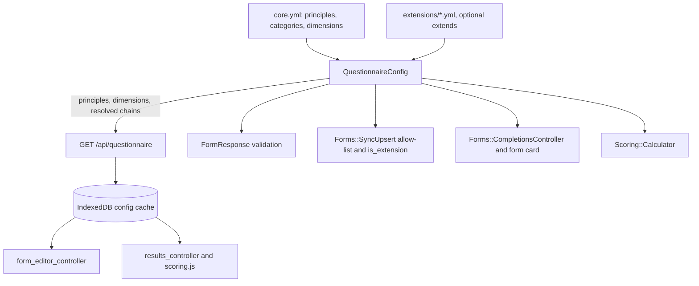
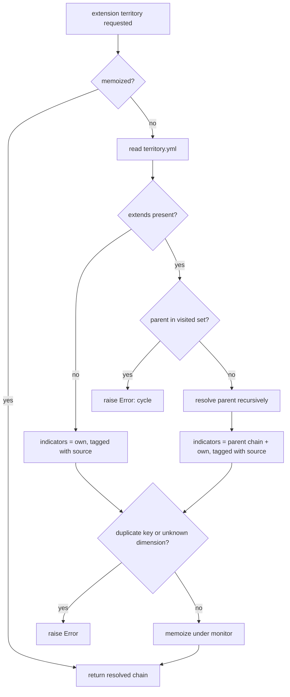

# Two-Level Questionnaire Config - Plan

## Goal Capsule

- **Objective:** Make the questionnaire config two-level. `core.yml` holds six directly answered agroecology principles (Level 1) plus the category and dimension structure; every Level 2 indicator lives in a territory extension, extensions can extend one another, and scoring, validation, sync, editor, results, seeds, and docs follow that model.
- **Authority:** this plan, then `AGENTS.md` and Telos standards. The user's preferences override the landing strategy.
- **Execution profile:** Ruby plus importmap JavaScript, no database migration, one branch (`chile-questionnaire-level-1`). Specs via `bundle exec rspec`, lint via `bundle exec rubocop`, browser smoke for client units (no JS test harness exists).
- **Stop conditions:** stop and surface if (1) the user-owned pre-flight finds stored data against removed keys: before U1, the user runs `FormResponse.where.not(indicator_key: <principle + all-indicator keys>).count` (or the equivalent placeholder/former-Chile-key list before U2 exists) on each non-development database and it is non-zero, so a data cleanup must be agreed first (the executor cannot reach those databases); (2) a chile indicator's provisional dimension (Appendix A) does not exist in `core.yml`; (3) expressing a real extension needs override or exclude semantics (`extends` is add-only here).
- **Tail ownership:** the executor runs the Verification Contract and stops at a reviewable branch. No commit, push, or PR without the user's explicit request.

---

## Product Contract

### Summary

Split questionnaire config into structure and content. `core.yml` keeps the six agroecology principles (Level 1, answered directly; they are the L1 score and the results radar) and the fourteen dimensions under their categories, and nothing else. Every Level 2 question lives in a territory extension that names its dimension and may extend a parent extension. `chile.yml` is reseeded with prediapp's questions minus the north-only and south-only ones. The response flag keeps its column and comes to mean "answered from a territory file".

### Problem Frame

The app models Level 1 as six categories whose score is derived by averaging Level 2 indicators. Nobody answers a Level 1 question. prediapp, the Chilean predecessor this app replaces, does the opposite: Level 1 is six principles the farmer scores directly (`Form::LEVEL_ONE_ENTRIES`), and it is the entry door to the deeper Level 2 diagnosis. ADR-2 encodes the derived model, and `Scoring::Calculator`, `lib/scoring.js`, the results radar, and the acceptance criteria all follow it.

The 74 indicators in `core.yml` are scaffolding, not prediapp's questionnaire. Their content will come from an agroecology specialist, so the config needs a shape where core carries structure and territory files carry questions. Territory extensions today are an all-or-nothing side list: rendered in a separate tab that ignores each indicator's dimension, excluded from scoring, and flagged by `is_extension = !core_indicator?(key)`, a shortcut that only holds while there are exactly two kinds of response.

The next territory, Chiloe, must contain everything Chile contains plus its own questions. YAML has no include directive, so inheritance has to live in the loader. prediapp's seven zone-conditional water questions (north-only, south-only) are excluded for now and fit that same inheritance model later.

### Requirements

**Configuration structure**

- R1. `core.yml` defines six principles (key, i18n key, position) and the existing six categories with fourteen dimensions. It defines no indicators, and no `level` field appears on principles, categories, or indicators (nothing reads it).
- R2. Every Level 2 indicator lives in a file under `config/questionnaire/extensions/` and names one core dimension.
- R3. An extension may declare `extends: <territory>`. Its resolved indicator list is the parent chain's indicators followed by its own, to any depth. A load error is raised on a cycle, an unknown parent, an unknown dimension, or a key declared in more than one extension file (keys are global response identifiers with a shared locale namespace and a union permit list, so uniqueness is checked across all of `extension_keys`, not just one chain).
- R4. `chile.yml` contains prediapp's Level 2 questions except the seven north-only and south-only water questions, with normalized keys and the provisional dimension mapping in Appendix A. The eight former Chile-specific indicators are removed.
- R5. Locale files carry a `name` for every principle (`questionnaire.principles.<key>`) and every chile indicator (`questionnaire.indicators.<key>`) in Spanish (prediapp's labels, accent-free per the file's convention) and English (translation, marked provisional). `description` and `scoring` entries are optional.

**Responses and validation**

- R6. A response's `is_extension` is true when its key belongs to the resolved chain of the form's territory and false for principles. No migration.
- R7. A response key is valid when it is a principle key or belongs to the form's resolved chain. The model validation, the sync allow-list, the API permit list, and the client's save and prune paths apply the same rule.
- R8. Changing a form's territory prunes indicator responses that are not in the new chain and keeps principle responses.

**Scoring**

- R9. `l1_scores` is each principle's raw answer, nil when unanswered. The category rollup is removed.
- R10. `l2_scores` is, per dimension, the mean (one decimal) of the answered chain indicators in that dimension, 0 when none is answered.
- R11. `Scoring::Calculator` and `lib/scoring.js` produce identical output for the shared parity fixture, which includes principle answers and chile indicator answers.

**Completion and progress**

- R12. A form can be completed only when every principle and every indicator in its resolved chain is scored. A form without a territory completes on principles alone. Server and client enforce the same rule.
- R13. Progress totals in the editor and on the form card count principles plus chain indicators.

**Editor and results**

- R14. The editor shows a Principles section first, then one section per dimension that has at least one chain indicator; dimensions with none are hidden. Each extension indicator card shows a provenance badge naming its source extension.
- R15. A question whose only translation is `name` renders without description or rubric blocks; the 1 to 10 scale still works.
- R16. Results show the Level 1 radar over the six principles, and dimension bars and indicator lists over the chain; dimensions with no chain indicators are hidden.

**API and offline cache**

- R17. `GET /api/questionnaire` returns `principles`, `categories`, `dimensions`, and `extensions`, each extension pre-resolved with its `extends` value and a per-indicator `extension` source. The top-level `indicators` array is removed. The fingerprint mechanism is unchanged.

**Documentation and seeds**

- R18. ADR-2, `docs/acceptance-criteria.md`, `docs/testing.md`, `docs/database.md`, and `CONCEPTS.md` describe the two-level model, `extends`, and the new meaning of `is_extension`. `db/seeds.rb` seeds forms with territory chile.

### Scope Boundaries

- Authoring indicator descriptions or scoring rubrics. The specialist owns content; this plan ships labels only.
- prediapp's north-only and south-only water questions.
- `chiloe.yml` content. The mechanism ships; the file does not.
- An aggregate Level 1 number, PDF output, renaming the `indicator_key` column, any database migration, a JavaScript unit-test harness.

#### Deferred to Follow-Up Work

- `chile-norte.yml` and `chile-sur.yml` extending `chile` for the seven zone questions.
- `chiloe.yml` once specialist content exists.
- Specialist review of the Appendix A mapping, of the English labels, and of the `crop_health` placement.
- A Capybara system spec for the editor completion flow. The sync-race learning in `docs/solutions/` names browser-level checks as the durable regression path for this layer; none exists yet.

### Acceptance Examples

- AE1. **Given** a form with territory chile and every principle and chile indicator scored, **when** completion is requested, **then** the form completes.
- AE2. **Given** a form with no territory and all six principles scored, **when** completion is requested, **then** it completes; with one principle unscored it is refused, naming the Principles section.
- AE3. **Given** a chile form with one chile indicator unscored, **when** completion is requested, **then** it is refused, naming that indicator's dimension.
- AE4. **Given** a `chiloe.yml` that extends `chile` and adds two indicators, **when** the config loads, **then** chiloe's resolved indicators are chile's 72 followed by the two, each tagged with its source extension.
- AE5. **Given** a chile form with answers, **when** the territory changes to chiloe, **then** every chile answer remains; **when** it changes to none, **then** all indicator answers are pruned and principle answers remain, in IndexedDB and on the server, and a full sync round-trip does not resurrect them.
- AE6. **Given** the parity fixture, **when** both calculators run, **then** `l1_scores` and `l2_scores` are equal.
- AE7. **Given** an indicator with only a `name` translation, **when** its card renders, **then** the name and the ten buttons appear and no description or rubric block does.

### Open Questions

All deferred, none blocks implementation:

- Specialist confirmation of the Appendix A mapping, in particular whether `crop_health` questions sit under `system_resilience` or need a dimension of their own.
- Specialist descriptions and rubrics for the six principles and the 72 chile indicators.
- Review of the provisional English labels.

---

## Planning Contract

### Key Technical Decisions

- KTD-1. **Principles are a top-level list in `core.yml`, separate from categories and dimensions.** They are answered directly and belong to no dimension; modeling them as indicators under a fake dimension would feed them into the Level 2 rollup.
- KTD-2. **`extends` is resolved server-side in `QuestionnaireConfig`, add-only, any depth.** Cycle, unknown parent, a key declared in more than one extension file, and unknown dimension raise `QuestionnaireConfig::Error` at load. Resolution recurses into `extension` (for the parent) and into `load_core!` (to check dimensions) while holding the config lock, so the lock is a reentrant `Monitor`, not `Mutex` (Ruby's `Mutex` raises `ThreadError` on recursive locking). The API ships resolved chains, so the client keeps one flat list per territory and no resolver. The fingerprint already hashes every extension file. Override and exclude semantics wait for an extension that needs them.
- KTD-3. **`is_extension` means "from a territory file", computed by chain membership.** Column and API field are unchanged. The model scopes `core` and `territory_extensions` become `principles` (false) and `indicators` (true); every consumer of the old scopes changes in this plan anyway, and a `core` scope that returns principles would mislead.
- KTD-4. **Response-key validation becomes territory-aware on `FormResponse`.** Today extension rows skip validation entirely. The model validates every row against the form's chain; `Forms::SyncUpsert` and `Api::FormsController` keep their pre-checks so unknown keys still produce a clean 422 with per-key errors. The `SyncUpsert` allow-list is built from the *incoming* territory (`attributes[:territory_key]` when the payload carries it, else the stored `form.territory_key`), so a payload that both switches territory and sends the new territory's keys is accepted in one push rather than 422-looping on the stale territory.
- KTD-5. **Scoring universe is principles plus the resolved chain; the category rollup is deleted; no aggregate Level 1 scalar.** The parity fixture is reshaped first and both calculators are made to match it.
- KTD-6. **Dimensions with no chain indicators are hidden in editor and results.** With the provisional chile mapping, `water_quality`, `water_management`, and `climate_adaptation` have no questions until specialist content lands. An empty section is noise and would confuse the progress rule.
- KTD-7. **Label-only questions are first-class.** Editor and results render description and rubric blocks only when the translation key is present in the cached locale map (`t()` returns the key itself when missing, so presence must be checked, not the returned string).
- KTD-8. **prediapp keys are normalized once, at port time**: `compactation` to `compaction`, `traiditional_crops_seeds` to `traditional_crops_seeds`, `food_convervation` to `food_conservation`, `infected_plants_remotion` to `infected_plants_removal`. Keys become permanent response identifiers, so this is the last cheap moment. All other keys are kept verbatim for cross-reference with prediapp, including the indicator `crop_diversity` that shares its string with a dimension key (different namespaces; noted for the specialist).
- KTD-9. **One shared `questionnaire.indicators.*` locale namespace across extensions**, so a child extension reuses its parent's translations. Principles live under `questionnaire.principles.*`.
- KTD-10. **The territory select lists every extension key**, parents and children alike, labeled by `key.humanize` as today.
- KTD-11. **Seeds and factories move to territory chile.** Seed forms set `territory_key: "chile"` and receive principle plus chile responses; the `form_response` factory defaults to a principle key; `:completed_with_responses` sets territory chile and creates principles plus the chain.
- KTD-12. **An unknown or blank `territory_key` degrades to territory-less, never raises.** `extension_indicator_keys` and the chain lookups return empty for a blank or unrecognized territory (checking `extension_keys` membership before calling `extension`, which itself still raises on an unknown file), so the form card, completion, and calculator treat such a form as principles-only instead of 500-ing on `QuestionnaireConfig::Error`. `Form` also validates `territory_key` inclusion in `extension_keys` (allow blank), so the sync path returns 422 for a bad value rather than persisting it.

### High-Level Technical Design

Config flows from two file groups through one loader to every consumer. The client never resolves inheritance; it receives flat per-territory lists.

Extension resolution:

Completion rule, shared by server and client: required keys = principle keys + chain keys for the form's territory (chain is empty without a territory); the form is completable when every required key has a response. Missing keys are reported as "Principles" when a principle is missing and as the dimension name for indicators.

### System-Wide Impact

- **Data:** no schema change. The meaning of `is_extension` narrows to "from a territory file"; existing rows are consistent with the new rule as long as no real data references removed keys (see Risks).
- **Offline clients:** the config fingerprint changes on deploy, so every client refetches config and both locales on next online load (KTD-8 of the offline plan). A draft that still carries a removed key would otherwise 422 on every push with no user-visible signal (the 422 path calls `notify("error")`, which only repaints the pending badge; it is not the conflict dialog, and the queue entry and the form's dirty flag persist so the form can never complete or reseed). U6 makes the migration self-healing: on a fingerprint change the client deletes local `form_responses` rows whose key is neither a principle nor in any extension chain, regardless of `is_extension`, and re-enqueues the affected forms.
- **Scoring parity:** the fixture contract between Ruby and JS is preserved, with a new shape.
- **Docs:** ADR-2 is superseded; acceptance criteria 4.1, 4.3, and 6.1 invert (Level 1 becomes direct entry, extensions become required and scored).

### Risks & Dependencies

- **Stored responses against removed keys.** Dev seeds are the only known source. If a non-development database has forms, removing the placeholder keys makes those rows fail validation on next update and, once served to a client, drives the permanent 422 loop above. Stop condition 1 is the guard; it is a user-owned pre-flight query (see Goal Capsule), not something the executor can check.
- **Provisional mapping is wrong for some questions.** Cheap to fix (a YAML edit and a fingerprint bump). The file header and Appendix A mark it provisional.
- **Three empty dimensions for chile** until specialist content arrives. Hidden by KTD-6; the results page shows eleven bars, not fourteen.
- **Client changes are verified in the browser only.** No JS harness exists and bolting one on fights the importmap architecture (per the sync-race learning). The parity fixture pins the math; the Verification Contract carries a browser checklist for the rest.
- **`db.js` write discipline.** The sync-race learning documents that a full-record `put` from a stale in-memory copy erases sync metadata. U7 changes `saveResponse` and `pruneStaleExtensions` call sites, not `saveForm`; keep partial updates and do not introduce a new full-record write.
- **Label-only rendering depends on how missing keys are detected.** `t()` returns the key string when a translation is absent; check presence in the translation map rather than comparing the returned text.
- **Scores are computed at read time from the live config, never snapshotted.** When the specialist later remaps a question or adds a dimension, every already-completed form's `l2_scores` and dimension bars change retroactively. Out of scope to fix here (no score snapshot), but the dimension list is as provisional as the mapping; flag before real diagnoses are collected.
- **Mandatory Level 2 for a territory form.** R12 requires every chain indicator, so a field agent cannot complete a Level-1-only assessment for a chile farm without clearing the territory, which then prunes any Level 2 answers already given. This is the confirmed completion rule, named here as a known tradeoff; revisit if prediapp allowed Level-1-only completion.

---

## Implementation Units

Units are grouped in dependency order: config and loader, then responses and completion, then scoring, then API and client, then docs and seeds.

### U1. Reshape questionnaire YAML and locales

- **Goal:** `core.yml` carries principles and structure only; `chile.yml` carries prediapp's 72 questions; locale files match.
- **Requirements:** R1, R2, R4, R5
- **Dependencies:** none
- **Files:** `config/questionnaire/core.yml`, `config/questionnaire/extensions/chile.yml`, `config/locales/es/questionnaire.yml`, `config/locales/en/questionnaire.yml`, `config/locales/es.yml`, `config/locales/en.yml`
- **Approach:** In `core.yml`, add a top-level `principles:` list (six entries, prediapp order: biodiversity, recycling, interactions, soil_management, pest_management, traditional_knowledge; each with `key`, `i18n_key: questionnaire.principles.<key>`, `position`), delete every `indicators:` block, and remove `level` from categories (keep `position`). Rewrite `chile.yml` with `territory`, `i18n_key`, and 72 indicators per Appendix A (`dimension`, `i18n_key`, `position` following prediapp's order within each source dimension; no `level` field), with a header comment stating the dimension mapping is provisional pending specialist review. In both questionnaire locale files, delete the 74 placeholder indicator blocks and the eight Chile blocks, add a `principles:` block with `name` per principle, and add `name` per chile indicator under `indicators:`; Spanish from prediapp's `activerecord.attributes.form` labels with accents stripped to match the file, English as provisional translations. Add UI strings to `es.yml` and `en.yml`: the Principles section title, a hint shown when no territory is selected, and a completion flash for missing principles.
- **Patterns to follow:** existing `core.yml` and `chile.yml` field shape; accent-free Spanish in `config/locales/es/questionnaire.yml`.
- **Test scenarios:** `Test expectation: none` beyond YAML parsing here; structural assertions live in U2's specs so the loader and the files are tested together.
- **Verification:** all three YAML files parse; `QuestionnaireConfig.reload!` followed by `extension("chile")` (after U2) yields 72 indicators; a grep for any removed placeholder key across `config/` returns nothing.

### U2. QuestionnaireConfig: principles, extends, territory-aware lookups

- **Goal:** the loader exposes principles, resolves extension chains, and answers "is this key allowed for this territory".
- **Requirements:** R1, R3, R6, R7
- **Dependencies:** U1
- **Files:** `lib/questionnaire_config.rb`, `spec/services/questionnaire_config_spec.rb`
- **Approach:** `load_core!` parses `principles` and builds categories without `level`; drop the `level` fetch from `build_indicator`/`load_extension!` too. Add `principles`, `principle?(key)`, `principle_keys`. Remove `core_indicators`, `core_indicator?`, and `indicator(key)`; every caller is rewritten in U3 to U6. `extension(key)` resolves `extends` recursively with a visited set, returns `{territory, i18n_key, extends, indicators}` where each indicator carries `extension: <source territory>`, and raises `Error` on cycle, unknown parent, an indicator naming a dimension absent from core, or a key declared in more than one extension file (global uniqueness across `extension_keys`, checked once at load). Add `extension_indicator_keys(territory)` (empty for a blank territory or one not in `extension_keys`, so it never raises), `known_key?(key, territory)` (principle or chain member), and `all_indicator_keys` (union over `extension_keys`, for the API permit list). Use a reentrant `Monitor` (not `Mutex`) for `extension`, `reload!`, and `load_core!`, because chain resolution re-enters the lock via the parent `extension` call and via `load_core!`; keep memoization and have `reload!` clear resolved chains.
- **Execution note:** write the extends specs against temporary YAML written into the spec's copied config directory. Hoist the existing `with_copied_config` helper out of `describe ".fingerprint"` to the top-level describe, and have it call `QuestionnaireConfig.reload!` before `yield` and again in an `ensure`, so each example reads the tmpdir YAML and no chain memoized from a tmpdir (or from the real file) leaks into later examples.
- **Patterns to follow:** existing `load_core!` and `load_extension!` structure and `Error` class in `lib/questionnaire_config.rb`.
- **Test scenarios:**
  - Loads six principles in position order; core exposes no indicators; no principle, category, or indicator carries a `level` field.
  - `extension("chile")` returns 72 indicators, each with `extension: "chile"` and a dimension that exists in core.
  - A child extending a parent resolves parent indicators first, then its own, each tagged with its own source; a three-level chain resolves the same way.
  - A cycle raises `Error`; an unknown parent raises `Error`; a key declared in two extension files raises `Error`; an indicator naming an unknown dimension raises `Error`.
  - `known_key?` is true for a principle with nil territory, true for a chile key with `"chile"`, false for a chile key with nil or another territory, false for an unknown key; `extension_indicator_keys` returns `[]` for nil, `""`, and an unknown territory without raising.
  - Principle keys and `all_indicator_keys` are disjoint.
  - Every principle and every chile indicator `i18n_key` has a `name` entry in both `config/locales/es/questionnaire.yml` and `config/locales/en/questionnaire.yml`.
  - Existing fingerprint specs still pass.
- **Verification:** spec file green; `bundle exec rubocop lib/questionnaire_config.rb` clean.

### U3. Territory-aware response validation, sync flag, API permit list, factories

- **Goal:** server-side response handling applies one rule for which keys a form may hold and how they are flagged.
- **Requirements:** R6, R7, R8 (server side)
- **Dependencies:** U2
- **Files:** `app/models/form_response.rb`, `app/services/forms/sync_upsert.rb`, `app/controllers/api/forms_controller.rb`, `spec/factories/form_responses.rb`, `spec/factories/forms.rb`, `spec/models/form_response_spec.rb`, `spec/requests/api/forms_spec.rb`
- **Approach:** `FormResponse` replaces the `core` and `territory_extensions` scopes with `principles` and `indicators` (KTD-3), validates every row with `QuestionnaireConfig.known_key?(indicator_key, form&.territory_key)` (dropping the early return for extension rows), and derives `is_extension` as "not a principle" before validation so callers cannot set it inconsistently. `Forms::SyncUpsert#unknown_indicator_keys` builds its allow-list from the *incoming* territory (`attributes[:territory_key]` when the payload carries the key, else `form.territory_key`) plus principle keys, so a push that switches territory and sends the new keys together is accepted. In `apply`, after `form.save!` and before `apply_responses!`, delete indicator rows outside the new chain (`form.form_responses.indicators` whose key fails `known_key?(key, form.territory_key)`) so a territory change prunes server-side and the reload cannot resurrect them (R8); `apply_responses!` no longer computes the flag itself. `Api::FormsController#known_indicator_keys` becomes principles plus `all_indicator_keys`. Factories per KTD-11 (`form_response` defaults to `biodiversity`; `:completed_with_responses` sets `territory_key: "chile"` and creates principles plus the chile chain).
- **Patterns to follow:** existing validation and scope style in `app/models/form_response.rb`; `Result` handling in `app/services/forms/sync_upsert.rb`.
- **Test scenarios:**
  - Model: a principle key is valid on a form with no territory and on a chile form; a chile key is valid on a chile form and invalid on a form with no territory or a different territory; an unknown key is invalid; `is_extension` is false for a principle row and true for an indicator row regardless of what was assigned.
  - Request `PUT /api/forms/:client_id`: a chile form accepts a chile key and serializes it with `is_extension: true`; a form without a territory gets 422 with a per-key error for a chile key; a payload switching a territory-less form to chile while sending chile keys is accepted in one push; a payload switching a chile form to nil while still sending a chile key gets 422 (incoming territory disallows it); a payload switching a chile form to nil with only principle keys returns 200, the DB keeps only principle rows, and the serialized `responses` omit the old chile keys; the existing unknown-key, out-of-range, stale, completed, and deleted cases pass with a principle key as the sample key.
  - `GET /api/forms` serializes a principle response with `is_extension: false`.
- **Verification:** both spec files green; rubocop clean on touched Ruby.

### U4. Completion and progress on the server

- **Goal:** the server completes a form only when principles and the territory chain are fully scored, and progress totals reflect that universe.
- **Requirements:** R12, R13
- **Dependencies:** U3
- **Files:** `app/models/form.rb`, `app/controllers/forms/completions_controller.rb`, `app/views/forms/_form_card.html.erb`, `spec/models/form_spec.rb`, `spec/requests/forms/completions_spec.rb`
- **Approach:** Put the rule on the model so the controller stays thin: `Form` gains `required_indicator_keys` (principles plus chain), `scored_keys` (read from the preloaded `form_responses` association, not a per-card query, since the index already applies `with_responses`), and `missing_sections` (a list that names Principles when any principle is unscored and each dimension with an unscored chain indicator). `Form` also validates `territory_key` inclusion in `QuestionnaireConfig.extension_keys`, `allow_blank: true` (KTD-12), so a bad territory is a 422 rather than a 500 in the card, completion, and calculator paths. `CompletionsController#create` calls `missing_sections` and builds the flash from it, using the new locale string for principles. The form card computes total and scored from the same model methods.
- **Patterns to follow:** `Form` already owns its AASM transitions; the controller's current flash-and-redirect shape.
- **Test scenarios:**
  - Covers AE1. A chile form with everything scored completes.
  - Covers AE2. A territory-less form with six principles completes; with five it is refused and the flash names Principles.
  - Covers AE3. A chile form missing one indicator is refused and the flash names that dimension.
  - A completed form redirects without change (existing behavior).
  - Model: `required_indicator_keys` is 6 without a territory and 78 with chile; `missing_sections` ordering puts Principles first.
  - Card: a chile draft shows `n/78`, a territory-less draft shows `n/6`.
  - Model: `territory_key: "chile"` and blank are valid; an unrecognized territory is invalid.
- **Verification:** spec files green; rubocop clean.

### U5. Scoring: parity fixture, Ruby calculator, JS port

- **Goal:** both calculators compute Level 1 from principles and Level 2 from the territory chain, and agree on the shared fixture.
- **Requirements:** R9, R10, R11
- **Dependencies:** U2, U3
- **Files:** `spec/fixtures/scoring_parity.json`, `app/services/scoring/calculator.rb`, `app/javascript/lib/scoring.js`, `spec/services/scoring_calculator_spec.rb`
- **Execution note:** Reshape the fixture first (territory chile, six principle answers, chile answers with a few deliberately unanswered, expected `l1_scores` and `l2_scores`), then make the Ruby calculator match it, then the JS port. The fixture is the contract; do not derive expected values from either implementation.
- **Approach:** `Scoring::Calculator` reads all of the form's responses, builds the indicator universe from `QuestionnaireConfig.extension(form.territory_key)` (empty without a territory), returns `indicator_scores`, `l2_scores` per dimension over that universe, and `l1_scores` keyed by principle; `build_l1_scores` over categories is deleted. `calculateScores(config, responses, territoryKey)` mirrors it using the resolved extension list from the cached config; the categories loop is deleted.
- **Patterns to follow:** current `round(1)` and "0 when no values" conventions in both files; the fixture-driven spec.
- **Test scenarios:**
  - Covers AE6. Ruby output equals the fixture's `l1_scores` and `l2_scores`.
  - A form without a territory yields every `l2_scores` entry 0 and `l1_scores` from principles.
  - An unanswered principle yields nil for that key.
  - A dimension with no chain indicators yields 0.
  - A chile indicator's value moves its dimension's mean (assert one dimension with mixed answered and unanswered indicators).
- **Verification:** spec green; JS parity checked in the browser on the seeded "Parity fixture" form (U9, responses loaded verbatim from `scoring_parity.json`) by comparing rendered dimension values and radar inputs against the fixture's expected values (the checklist in the Verification Contract).

### U6. API payload and client config cache

- **Goal:** the API ships principles and resolved extensions; the client cache exposes per-territory lookups.
- **Requirements:** R17
- **Dependencies:** U2
- **Files:** `app/controllers/api/questionnaires_controller.rb`, `app/javascript/lib/config_cache.js`, `app/javascript/lib/db.js`, `spec/requests/api/questionnaires_spec.rb`
- **Approach:** Payload becomes `fingerprint`, `principles`, `categories`, `dimensions`, `extensions` (already resolved by U2). `config_cache.js` replaces `coreIndicators` with `principles(config)`, `territoryIndicators(config, territoryKey)`, `dimensionIndicators(config, dimensionKey, territoryKey)`, and `visibleDimensions(config, territoryKey)`; `extensionIndicators` stays as the alias the prune path uses. When `refresh` detects a changed fingerprint, it also deletes local `form_responses` rows whose key is neither a principle nor in any extension chain (regardless of `is_extension`, via a `db.js` helper) and re-enqueues the affected forms, so a draft carrying keys removed by this refactor heals itself instead of 422-looping.
- **Patterns to follow:** existing helper shape in `config_cache.js`; the request spec's payload assertions.
- **Test scenarios:**
  - Payload has six principles with `key`, `i18n_key`, `position`; fourteen dimensions each with `category`; no top-level `indicators`; `extensions.chile.indicators` has 72 entries each with `dimension` and `extension: "chile"`; `extensions.chile.extends` is null.
  - Fingerprint equals `QuestionnaireConfig.fingerprint` (existing).
  - Unauthenticated request returns 401 JSON (existing).
- **Verification:** spec green.

### U7. Editor: principles first, chain-merged dimensions, label-only cards

- **Goal:** the offline editor presents Level 1 as the first section, merges extension questions into their dimensions, and applies the shared completion rule.
- **Requirements:** R8 (client), R12 and R13 (client), R14, R15
- **Dependencies:** U5, U6
- **Files:** `app/javascript/controllers/form_editor_controller.js`, `app/javascript/controllers/offline_forms_controller.js`, `app/javascript/lib/db.js`, `app/javascript/lib/i18n.js`, `app/views/forms/_editor.html.erb`
- **Execution note:** smoke-first in the browser; there is no JS harness. Run the editor checklist in the Verification Contract before and after, and re-run the sync-race repro from `docs/solutions/logic-errors/offline-form-sync-clobbers-inflight-edits.md` since this unit touches response persistence.
- **Approach:** `dimensions()` returns a Principles pseudo-section first (key `principles`, title from the new locale string), then `visibleDimensions` for the form's territory; the synthetic extension section and the dimension-level extension badge go away. `indicatorsFor` returns principles for the first section and `dimensionIndicators(config, key, territory)` otherwise. `isExtension` at save time is "not a principle" by membership in `config.principles`. `dropStaleExtensions` uses `territoryIndicators` for the allowed set (principles are never pruned). `refreshCompleteState` and `updateProgress` use principles plus the chain as the universe. `indicatorCard` shows a small badge when `indicator.extension` is set and renders the description toggle and the three rubric rows only when the corresponding translation keys exist in the loaded map (KTD-7). When no territory is selected, the header under the Principles section shows the new hint. `db.js` keeps `saveResponse` and `pruneStaleExtensions` signatures; no new full-record writes. `offline_forms_controller.js` no longer reads the removed `config.indicators`; its per-form card total becomes `principles(config).length + territoryIndicators(config, form.territory_key).length`. For the label-only check (KTD-7), capture the map `i18n.js#load()` returns (or add a `has(key)` export) and test key presence against it, since `t()` returns the key itself when a translation is missing.
- **Patterns to follow:** the existing `indicatorCard` and `renderNav` structure; `offline.extension_badge` string; storage-layer merge discipline from the sync-race learning.
- **Test scenarios:** browser checklist (no automated harness):
  - Covers AE7. A label-only question shows name and buttons only; a question with rubric translations still shows them.
  - New form without a territory: first section is Principles, no dimension sections, hint visible, Complete disabled until six principles are answered.
  - Select chile: dimension sections appear in category order, `water_quality`, `water_management`, and `climate_adaptation` are absent, extension cards show the badge, progress reads `n/78`.
  - Covers AE5. Switch chile to none: indicator answers disappear from the UI and IndexedDB, principle answers stay, progress reads `n/6`; after a full sync round-trip they do not reappear (server prune, U3).
  - Offline forms list: a chile draft card reads `n/78` and a territory-less draft card reads `n/6`; the list renders offline without error.
  - A draft created before this deploy (holding removed keys) syncs clean after one online reload, and its pending badge clears.
  - Answer everything for chile while online: Complete enables; offline: hint asks to sync first (existing behavior).
- **Verification:** checklist passes; `log/development.log` shows no 422 for known keys during the run.

### U8. Results: principles radar, chain dimensions

- **Goal:** the results page charts Level 1 as the six principles and Level 2 over the territory chain.
- **Requirements:** R16
- **Dependencies:** U5, U6
- **Files:** `app/javascript/controllers/results_controller.js`
- **Approach:** `renderRadar` labels come from each principle's `name` translation and scores from `l1Scores` (0 when nil, as today). `calculateScores` receives `form.territory_key`. `renderDimensions` and `renderIndicators` iterate `visibleDimensions` and `dimensionIndicators` for the territory; indicator rows show the extension badge when set.
- **Patterns to follow:** the DOM-built radar mount already in the file.
- **Test scenarios:** browser checklist:
  - The seeded "Parity fixture" chile form shows a six-axis radar labeled with principle names and eleven dimension bars, with values equal to the fixture's expectations.
  - A territory-less form shows the radar and no dimension bars.
  - Indicator rows under a dimension include chile questions with the badge.
- **Verification:** checklist passes; values match the parity fixture for the seeded form used in U5.

### U9. Documentation, glossary, and seeds

- **Goal:** the written architecture matches the shipped model, and development data exercises it.
- **Requirements:** R18
- **Dependencies:** U1 through U8
- **Files:** `docs/architecture.md`, `docs/acceptance-criteria.md`, `docs/testing.md`, `docs/database.md`, `CONCEPTS.md`, `db/seeds.rb`, `spec/fixtures/scoring_parity.json` (read by the seed)
- **Approach:** Rewrite ADR-2 in place: title to "YAML-Driven Two-Level Questionnaire", context and decision describing principles in core, indicators in extensions, `extends`, the loader's lookup methods, and consequences (comparability now rests on shared principles and shared dimensions; extensions are scored into dimensions; `is_extension` means "from a territory file"). In `docs/acceptance-criteria.md`, rewrite 4.1 as Principles entry, 4.3 to say extension indicators appear under their dimension, are required for completion, and feed Level 2 scores, 6.1 to chart principles, and the progress example on line 88. In `docs/testing.md`, replace the config and calculator bullets (six principles, no core indicators, chile 72, extends cases, Level 1 from principles, extensions included). In `docs/database.md`, update the `indicator_key` example, the `is_extension` description, and the "core indicators always present" note. In `CONCEPTS.md`, update Completed to "every principle and every indicator of the form's territory is scored". Seeds per KTD-11, with the partial draft holding principles plus the first twenty chile indicators. Add one completed chile form named "Parity fixture" whose responses are loaded verbatim from `spec/fixtures/scoring_parity.json`, so the JS parity gate (U5) and the results checklist (U8) run against known-expected values rather than random seed data.
- **Patterns to follow:** ADR format already in `docs/architecture.md`; glossary entry style in `CONCEPTS.md`.
- **Test scenarios:** `Test expectation: none` for prose. Seeds: `bin/rails db:seed` on a reset development database completes and the seeded completed forms hold 78 responses each with territory chile.
- **Verification:** grep for `L1 categor`, `74 `, `core_indicators`, and any removed placeholder key across `docs/`, `app/`, `spec/`, and `db/` returns nothing; seeds run clean.

---

## Verification Contract

| Gate | Command or check | Units | Done signal |
|---|---|---|---|
| Specs | `bundle exec rspec` | U2 to U6, U9 (factories) | green |
| Lint | `bundle exec rubocop` (includes `Harness/*` cops) | all Ruby | no offenses |
| Security | `bin/brakeman`, `bin/bundler-audit`, `bin/importmap audit` | CI parity | clean |
| Seeds | `bin/rails db:reset` on development | U9 | completes; seeded completed forms have territory chile and 78 responses |
| JS scoring parity | open the seeded "Parity fixture" chile form's results; compare radar inputs and dimension values with the fixture's expected values | U5, U8 | equal |
| Editor checklist | the browser scenarios listed under U7 | U7 | all pass, no 422 in `log/development.log` |
| Sync-race repro | the browser repro in `docs/solutions/logic-errors/offline-form-sync-clobbers-inflight-edits.md` | U7 | no conflict dialog, second PUT carries a base timestamp |

---

## Definition of Done

Global:

- Every gate in the Verification Contract passes.
- No reference to `core_indicators`, `core_indicator?`, the `core` or `territory_extensions` scopes, or the category-level `l1_scores` remains in `app/`, `lib/`, `spec/`, or `db/`.
- No placeholder indicator key or former Chile key remains anywhere in the repo (grep).
- ADR-2 and the three other docs describe the shipped model; `CONCEPTS.md` Completed matches the completion rule.
- Dead-end or experimental code from abandoned approaches is removed from the diff.
- Deliverables contain no em dashes and no AI attribution.
- Nothing is committed or pushed unless the user asks.

Per unit:

| Unit | Done when |
|---|---|
| U1 | YAML parses; 72 chile indicators; locale `name` present for every principle and indicator in ES and EN |
| U2 | Loader specs green, including extends, error, and disjointness cases |
| U3 | Model and API request specs green with the new rule and flag |
| U4 | Completion specs cover AE1 to AE3; card totals correct for chile and no-territory drafts |
| U5 | Fixture reshaped; Ruby spec green; JS matches in the browser |
| U6 | Payload spec green; cache helpers exported and used by U7 and U8 |
| U7 | Editor checklist passes (including offline list and pre-deploy-draft heal); sync-race repro clean |
| U8 | Results checklist passes |
| U9 | Doc greps clean; seeds run |

---

## Appendix

### A. Provisional mapping of prediapp Level 2 questions to core dimensions

Source: `Form::LEVEL_TWO_ENTRIES_BY_DIMENSION` in prediapp's `app/models/forms/entries.rb`; labels from prediapp's `config/locales/models/form/es.yml`. Mapping is the planner's proposal for the specialist to confirm. Confidence notes flag the placements most likely to move.

| prediapp dimension | Core dimension | Keys (normalized) | Note |
|---|---|---|---|
| soil_quality (12) | soil_health | soil_coverage, soil_erosion, compaction, infiltration, soil_depth, soil_structure, clod_stability, color_and_smell, root_development, residue_condition, biological_activity, organic_matter | direct |
| soil_ecological_management (7) | soil_management | crop_rotation, organic_fertilizers, leaf_fertilizers, efficient_microorganisms, soil_conservation, stubble_burning, weed_management | direct |
| crop_health (7) | system_resilience | crop_appearance, crop_growth, stress_tolerance, global_disease_incidence, insects_and_mite_presence, fungi_bacteria_viruses_presence, weed_presence | low confidence; no crop-health dimension in core |
| crop_sanity_management (4) | input_management | biocides_use, preventive_sanitary_measures, infected_plants_removal, sanitary_crop_rotation | medium |
| water_availability (3 of 10) | water_availability | irrigation_system, deep_well_water, water_quantity | direct; seven zone questions excluded |
| biodiversity (12), crop part | crop_diversity | crop_diversity, crop_variety, polycultures | split from prediapp's single dimension |
| biodiversity (12), ecosystem part | ecosystem_diversity | live_barriers, live_coverage, live_fences, forest_patches, spontaneous_vegetation, natural_enemies_diversity, pollinator_diversity, entomophages_released, entomopathogen_applications | split from prediapp's single dimension |
| seeds (3) | crop_diversity | seed_origin, traditional_crops_seeds, local_seed_banks | medium |
| agroecological_practices_knowledge (4) | social_wellbeing | agroecological_farmers_knowledge, soil_practices_number, disease_practices_number, recycling_practices_number | low confidence |
| agroecological_producers_organizations (3) | social_wellbeing | agroecological_organizations, participation_conviction, territorial_participation | medium |
| agroecological_transformation_decision (3) | farm_planning | transformation_conviction, decision_for_practices, experience_transmission | medium |
| marketed_products (3) | economic_viability | agricultural_commercialized_products, animal_commercialized_products, territorial_commercialization | direct |
| income_level (3) | economic_viability | production_destination, income, income_sources_diversity | direct |
| self_consumption_food (3) | social_wellbeing | family_food_availability, food_conservation, family_food_diversity | medium |
| own_inputs_production (2) | input_management | inputs_produced, input_production_percentage | medium |
| farm_origin_animal_feed (3) | animal_management | animal_feed_conservation, animal_feed_production_percentage, animal_feed_production | direct |

Resulting chile counts per core dimension: soil_health 12, soil_management 7, water_availability 3, crop_diversity 6, ecosystem_diversity 9, farm_planning 3, input_management 6, animal_management 3, economic_viability 6, social_wellbeing 10, system_resilience 7; `water_quality`, `water_management`, and `climate_adaptation` 0. Total 72.

Excluded zone questions (future `chile-sur` and `chile-norte` extensions): south `water_harvesting`, `well_water_availability`, `surface_water_accumulation`; north `water_canalization`, `arsenic_presence`, `boron_presence`, `salinity`.

### B. Principles ported from prediapp

`Form::LEVEL_ONE_ENTRIES`, in order: `biodiversity` (Biodiversidad), `recycling` (Reciclaje), `interactions` (Nivel de interaccion entre los componentes del sistema: animal, agricola, forestal, otros), `soil_management` (Manejo ecologico del suelo), `pest_management` (Manejo ecologico de plagas y enfermedades), `traditional_knowledge` (Bases culturales y conocimiento tradicional en el manejo del sistema). Principle keys share strings with the core category `biodiversity` and the core dimension `soil_management`; the namespaces are separate and no indicator key collides.

### C. Sources

- prediapp: `app/models/forms/entries.rb` (level lists, dimension grouping, zone lists), `app/models/form.rb` (level-one chart, zone detection), `config/locales/models/form/es.yml` (labels).
- This repo: `docs/architecture.md` ADR-2 (superseded by this plan), `docs/plans/2026-08-31-001-feat-offline-first-stack-plan.md` KTD-4 and KTD-8 (client-side scoring and fingerprint invalidation, both preserved), `docs/solutions/logic-errors/offline-form-sync-clobbers-inflight-edits.md` (write discipline for `db.js`).
